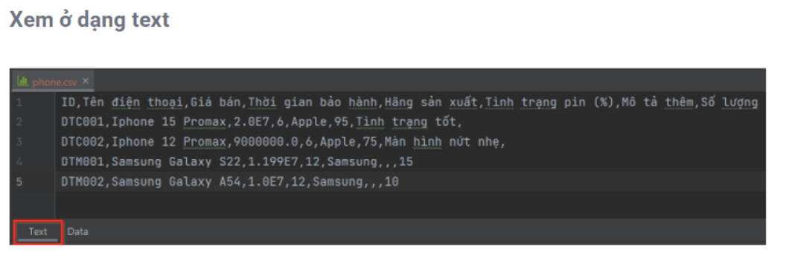
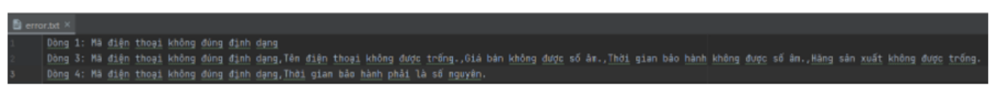

## Bài 1: XỬ LÝ FILE

**a.** Viết chương trình đọc vào tất cả các dòng của 1 file. Sau đó hiển thị tất cả thông tin đọc được trên cùng 1 dòng.

**b.** Viết chương trình đọc vào đúng 3 dòng của 1 file. Sau đó hiển thị các dòng đọc được ra màn hình console.

**c.** Viết chương trình đếm số lần xuất hiện của 1 từ nào đó trong 1 file. Mỗi từ được đặt ở trên 1 dòng của file.

**d.** Viết chương trình kiểm tra xem 1 đường dẫn đang chỉ đến 1 file hay 1 thư mục.

**e.** Viết chương trình xóa 1 file hoặc 1 thư mục cho trước.

**f.** Viết chương trình đổi tên 1 file hoặc 1 thư mục cho trước.

---

## Bài 2: ỨNG DỤNG QUẢN LÝ ĐIỆN THOẠI

## Đề bài

Bổ sung tính năng cho ứng dụng quản lý điện thoại để có khả năng đọc và lưu trữ dữ liệu từ một tệp tin. Dữ liệu này sẽ được tổ chức và lưu trữ trong tệp **phone.csv**, với mỗi sản phẩm điện thoại được biểu diễn trên một dòng và thông tin về sản phẩm được ngăn cách bởi dấu phẩy (,).

## Yêu cầu cụ thể

* Tạo một tệp tin có tên **phone.csv** để lưu trữ thông tin điện thoại. Tệp này sẽ không bao gồm hàng đầu tiên là tiêu đề mô tả thông tin.
* Đảm bảo rằng mỗi dòng trong tệp **phone.csv** biểu diễn một sản phẩm điện thoại và thông tin liên quan đến sản phẩm được ngăn cách bằng dấu phẩy (,).
* Ứng dụng phải có khả năng đọc dữ liệu từ tệp **phone.csv** và hiển thị thông tin về các sản phẩm điện thoại trong giao diện người dùng.
* File **phone.csv** có dạng như bên dưới (ngăn cách bởi dấu phẩy).

---

## Bài 3:  ỨNG DỤNG QUẢN LÝ ĐIỆN THOẠI - XÁC THỰC DỮ LIỆU

### 1. Đề bài

Bổ sung tính năng xác thực dữ liệu khi đọc dữ liệu từ file. Chỉ đưa dữ liệu hợp lệ trong file `phone.csv` vào `ArrayList` theo các yêu cầu cụ thể sau:

* **Tất cả các trường:** Bắt buộc phải có dữ liệu (không được để trống).
* **Giá bán:**
    * Phải là số thực.
    * Giá trị không được âm.

* **Thời gian bảo hành, Tình trạng pin (%), Số lượng:**
    * Phải là số nguyên.
    * Giá trị không được âm.

* **Mô tả thêm:**
    * Độ dài tối thiểu phải từ 10 ký tự trở lên.

### 2. Xuất thông tin lỗi (`error.txt`)

Các dòng dữ liệu không hợp lệ sẽ được ghi nhận vào file `error.txt` theo định dạng ví dụ dưới đây:

> **Nội dung file error.txt:**
> * **Dòng 1:** Mã điện thoại không đúng định dạng.
> * **Dòng 3:** Mã điện thoại không đúng định dạng, Tên điện thoại không được trống, Giá bán không được số âm, Thời gian bảo hành không được số âm, Hãng sản xuất không được trống.
> * **Dòng 4:** Mã điện thoại không đúng định dạng, Thời gian bảo hành phải là số nguyên.
> 
> 

